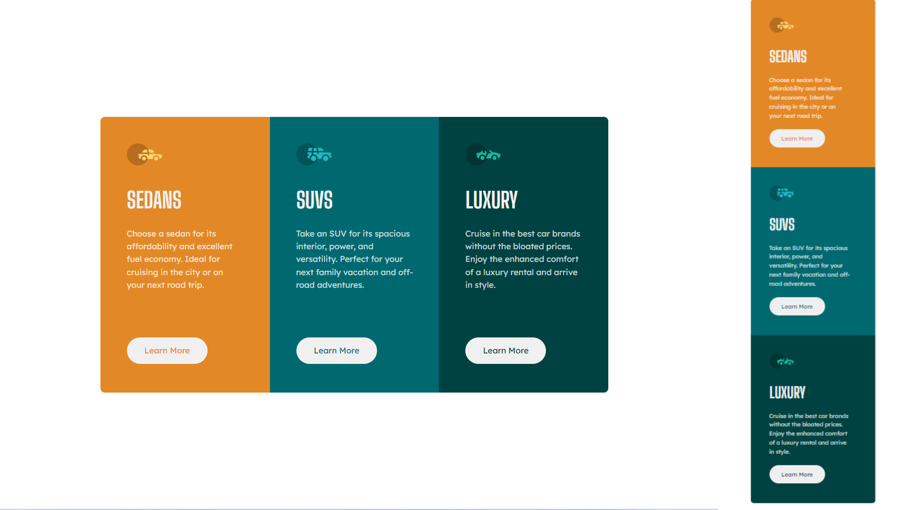

# Frontend Mentor - 3 Column Card Component

This is a solution to the [3 Column Card Component](https://www.frontendmentor.io/challenges/3column-preview-card-component-pH92eAR2-).

## Table of contents

- [Frontend Mentor - 3 Column Card Component](#frontend-mentor---3-column-card-component)
  - [Table of contents](#table-of-contents)
  - [Overview](#overview)
    - [Screenshot](#screenshot)
    - [Links](#links)
  - [My process](#my-process)
    - [Built with](#built-with)
  - [Author](#author)

## Overview

### Screenshot

### Links

- Solution URL: [Frontend Mentor](https://www.frontendmentor.io/solutions/3-column-preview-card-component-96vUjY-VdP)
- Live Site URL: [Github Pages](https://cozymeds.github.io/3-Column-Preview-Card-Component/)

## My process

### Built with

- Semantic HTML5 markup
- CSS custom properties
- Flexbox
- CSS Grid
- Mobile-first workflow
- [Styled Components](https://styled-components.com/) - For styles

## Author

- Frontend Mentor - [@Erratic56](https://www.frontendmentor.io/profile/Erratic56)
